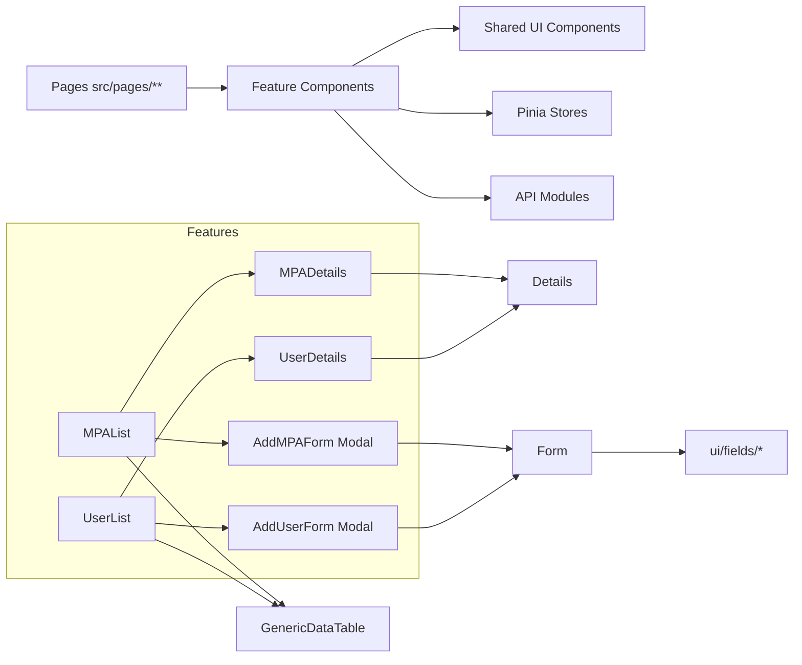

# Components Documentation

This document describes the high-level component architecture and links to feature-specific component documentation pages.

## Documentation Map

- [Components Index](./components/README.md)
- [Auth Components](./components/auth.md)
- [MPA Components](./components/mpa.md)
- [User Components](./components/users.md)
- [Shared UI Components](./components/ui.md)

## Architecture Overview

The component layer is grouped by feature and by shared UI primitives:

- `src/components/auth`: authentication UI (login/signup drawer and user menu)
- `src/components/mpa`: MPA feature UI (list, details, create modal, map dashboards/drawers)
- `src/components/users`: user management UI (list, details, create/edit forms)
- `src/components/ui`: reusable building blocks (form system, table system, modal system, header, field wrappers)

At runtime, page components under `src/pages/**` compose these feature components. Feature components consume API modules under `src/api/**`, state stores under `src/stores/**`, and shared composables/utilities.

## Core UI Contract Summary

For detailed behavior and component-level notes, see [Shared UI Components](./components/ui.md).

- `Form.vue`: schema-driven form renderer with field config mapping and submit/cancel/error event flow.
- `GenericDataTable.vue`: shared list shell for pagination, sorting, filters, context menu, and CSV export.
- `Details.vue`: shared details-page layout supporting view/edit and optional tabbed sections.
- `ui/fields/*`: field wrappers that normalize behavior/styling across forms.

## Practical Composition Patterns

1. List + Details Pattern

- List components (`MPAList.vue`, `UserList.vue`) provide row navigation into details routes.
- Details components (`MPADetails.vue`, `UserDetails.vue`) use `Details.vue` for consistent layout.

2. Modal Create Pattern

- Create actions from lists open modal forms (`AddMPAForm.vue`, `AddUserForm.vue`).
- Modals handle dirty-state confirmation via `ConfirmModal.vue`.

3. Shared Table Pattern

- Feature lists supply columns and data-fetching logic.
- `GenericDataTable.vue` centralizes UI behavior (filters, export, pagination, context actions).

4. Auth-Controlled UI Pattern

- Header visibility and create actions depend on auth store user state.
- Role-specific UI controls are resolved in feature components and header component.

## Interaction Flow Diagram

This diagram shows the typical list-to-details and list-to-create flow and where shared UI abstractions are reused.

## Notes for Future Development

- Prefer extending `GenericDataTable.vue` and `Details.vue` before introducing feature-specific duplicates.
- Keep field usage aligned with wrappers under `ui/fields` for visual and validation consistency.
- For new feature modules, follow the same structure: feature list, details, create form, optional drawer/modal subcomponents.
